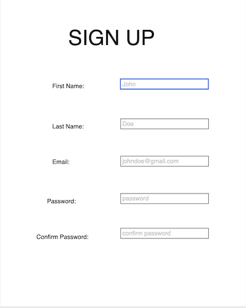
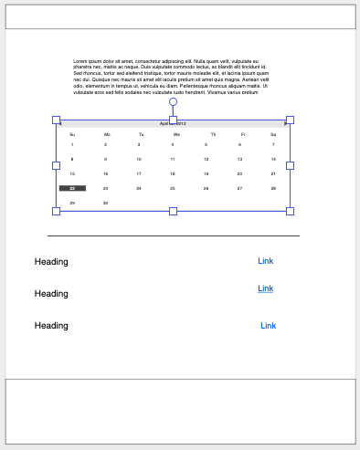
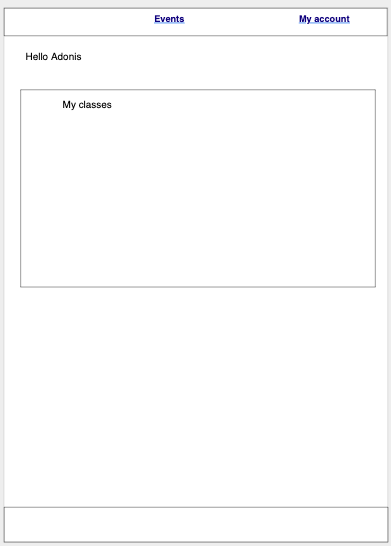

# Revive And Thrive

#### Revive and Thrive allows users to find and schedule workouts that fits well with their schedule. These workouts will include different types of workouts in the San Francisco Bay Area.

* From the Home Page:
    * User can click on sign up, if they have an account already, they can click on log in
* After signing up/logging in:
    * User can click on events to see the different types of workouts we offer, including the time and location of that workout
* From the events page:
    * User can add any class that fits their schedule
    * After adding their desired class/classes, the user can go back to their account page and see a list of all the classes they added
    * If they change their mind and wish to remove a class, they can do so from the account page. 

## Links

https://reviveandthrive.herokuapp.com/ -automatic

## Technologies Used

* Node
* Bootstrap
* MongoDB
* Mongoose
* Express
* Javascript
* CSS 

## Existing Features
* Sign Up
* Log in
* Add Events to profile
* Remove event(s) from account page

## Planned Features
* Make it mobile friendly
* Add healthy meal recipes 
* Add a button to add the recipes to account page
* Make facebook, twitter, and instagram page for Revive and Thrive and link our page to those pages

## Wireframes

